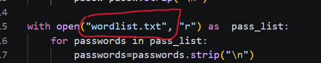
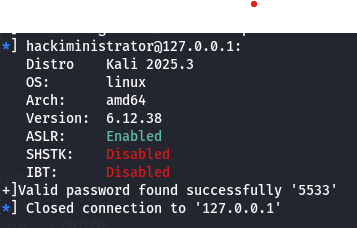

# SSH-BAZZUKAA
SECURE SHELL CONNECTION PASSWORD BRUTE-FORCE TOOL
# SSH Brute Force Tool

A Python-based SSH brute force tool for authorized penetration testing and cybersecurity lab environments.

> Disclaimer: This tool is intended only for educational purposes and authorized security testing. Do not use it against systems without explicit permission.

---

## Features

- Brute-force SSH login using a wordlist
- Prompts for:
  - Target IP address
  - SSH username
- Displays the discovered password if authentication succeeds
- Reports when no password in the wordlist matches

---

## Requirements

- Python 3.10 or later
- Pwntools

Install the required dependency:
pip install pwntools

---

## Folder Structure
SSH-BruteForce/
│
├── brute.py
├── wordlist.txt
├── requirement.txt
├── requirement.sh
└── README.md

Important:  
The wordlist.txt file must be located in the same directory as brute.py.

You may replace wordlist.txt with your own wordlist, but ensure the filename matches the one used in the script or update the script accordingly i.e in the code change this:

---

## Usage

Run the script:
python brute.py

The program will prompt for:
Enter Target IP:
Enter Username:

Example:
Enter Target IP: 192.168.1.10
Enter Username: kali

The tool will begin testing passwords from wordlist.txt.

---

## Output

### Successful Login
[+] Valid Password Found Succesfully: 'password123.

### Failed Login
[-] No Valid Password Found

---

## Notes

- Ensure the target machine is reachable.
- SSH must be running on the target.
- The default SSH port is 22 unless modified in the script.
- Place the wordlist in the same folder before running the tool.
-  During testing, the SSH server may temporarily refuse new connections after multiple failed authentication attempts. This behavior is typically caused by server-side security mechanisms (such as intrusion prevention or SSH connection limits), not by the tool itself. If this occurs, wait a few minutes before trying again or review the SSH server’s security configuration in your test environment.

---

## License

This project is intended for educational use and authorized security assessments only.
